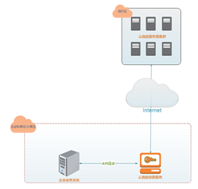

# 1.1产品介绍

> 来源: 招行云直联文档中心 (bizkey=DCCT20201215110811035, 节点=2026070917153763823)
> 抓取: 2026-09-03T06:16:22.296Z

---

1.1产品介绍 

 

 产品定义 

A．&nbsp;招商银行云直联是招商银行依托对公数字化渠道（包括企业网银、企业APP等）服务及产品，为企业客户提供与其计算机系统(含财务软件系统、资金管理系统、供应链管理系统、仓储管理系统以及第三方云服务平台等）直接联接的开放式API（Application Programming Interface）接入方式，实现银行与客户计算机系统的平滑对接和有机融合，满足客户通过内部计算机系统直接完成信息查询、转账支付、代发代扣、供应链金融等业务操作的需要。

B．&nbsp;招商银行云直联支持多种接入方式，支持“ 有前置有USB Key ”、“ 有前置免USB Key ”、“ 免前置 ”三种接入方式。其中：

“ 有前置有USB Key ”是指客户需要在自身计算机系统中安装我行提供的前置机程序并通过我行颁发的企业数字证书（USB Key）进行登录和交易。

“ 有前置免USB Key ”是指客户需要在自身计算机系统中安装我行提供的前置机程序并通过我行企业网银进行授权登录，且通过前置机程序与我行后台服务器进行密钥交换，后续通过云直联所发起的业务均通过该密钥进行加密、签名操作。

“ 免前置 ”是指客户无需在自身计算机系统中安装前置机程序，但需要客户生成符合我行要求的密钥，并将生成的相关密钥通过我行企业网银上传，与招商银行后台服务器进行密钥交换，后续通过云直联所发起的业务均通过该密钥进行加密、签名操作。
