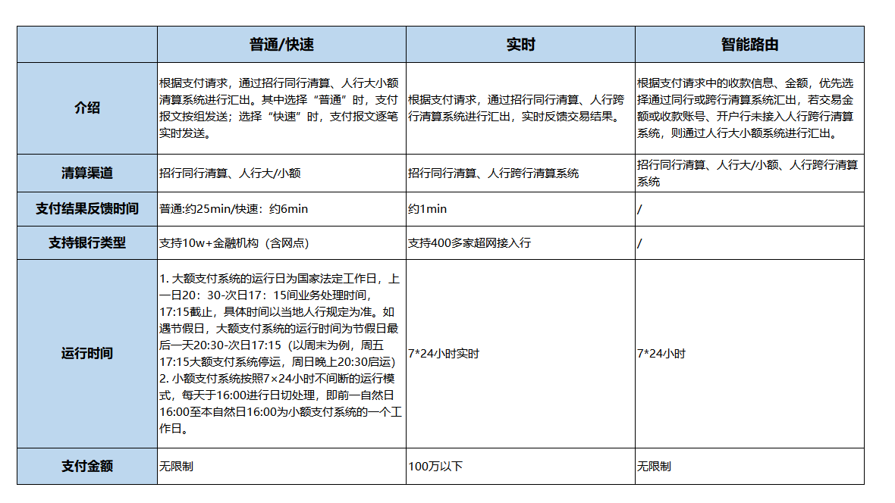
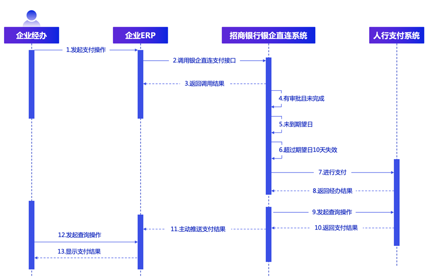

# 1.概述

> 来源: 招行云直联文档中心 (bizkey=DCCT20201214175701770, 节点=2026072217210411035)
> 抓取: 2026-09-03T06:25:52.477Z

---

【注意】 

 业务参考号（YURREF）是每笔交易的唯一编号，是防止重复提交的重要手段，如需重复发送请求，请务必保证同一笔交易的业务参考号不变，否则会存在重复提交风险。 

 报文结果判断逻辑：当返回报文head节点中resultcode字段为SUC0000时，表明请求已经被银行成功接收，不代表业务处理成功，业务处理结果请调用各个业务查询接口进行判断。返回其他错误码时，如果是查询类的请求可以直接重发，如果是经办类请求请先调用相应业务的查询接口判断之前请求是否有成功送达银行，确认没有记录后可以重发之前的请求，请注意：重发时请保证请求报文里面的业务参考号字段和之前请求里面的业务参考号一致（有特殊说明的接口除外），否则存在重复提交的风险。其他错误代码的描述请参见resultmsg的错误描述。 

【概述】

 企业通过支付API可向招商银行或他行开户的其它企事业单位进行付款，支付API支持单笔支付业务和批量支付业务。支付API允许客户在企业网银中设置审批流程，经办人员调用支付经办接口，需要审批人员完成审批后（如设置审批流程），才能对外发起支付。 

【支付渠道】

 人行目前有三种支付渠道：分别是大额支付系统、小额支付系统以及网上支付跨行清算系统（超网），目前该支付API支持普通模式（100万以下走小额支付系统，100万以上走大额支付系统）、快速模式（100万以下走小额支付系统，100万以上走大额支付系统）和实时模式（走超网渠道，限额100万）。 

 注意：周末（每周五17:00至周日21:00）放开小额支付系统业务金额上限（无限额）。 

  

【时序图】

【注意事项】

（1）客户支付时，应避开日切点时进行支付，避免有交易因为日切而失败。

（2）请求报文字段 yurRef (业务参考号) 用于标识该笔业务的编号，企业银行编号+业务类型+业务参考号必须唯一。企业自定义业务参考号，相同业务的业务参考号要始终保持唯一；

（3） 支付接口支持公对私支付，但需要考虑人行反洗钱监管要求 。使用对公支付接口进行对私支付业务时，必须是付款企业同个人间正常的业务往来，且交易摘要应该要说明公转私用途，或者用具体的代发功能办理。如果是企业的员工报销、福利发放、补贴发放之类， 建议企业使用代发业务进行 。

（4）支付经办请求接口返回的成功结果 仅代表“资金提出成功”，到账还是需要对手行进行入账处理，若查询出来状态不是终态的，说明资金正在落地处理中，不要让系统自动做“超时失败”设定！ 对于入账效率方面，每个银行的入账效率是不统一的，有个别城商行农信社入账需要人工落地处理，导致入账失败退款时间较长，可能要接近日终才会展现，因此建议客户可日终通过查询退票接口进行查询退票信息。
