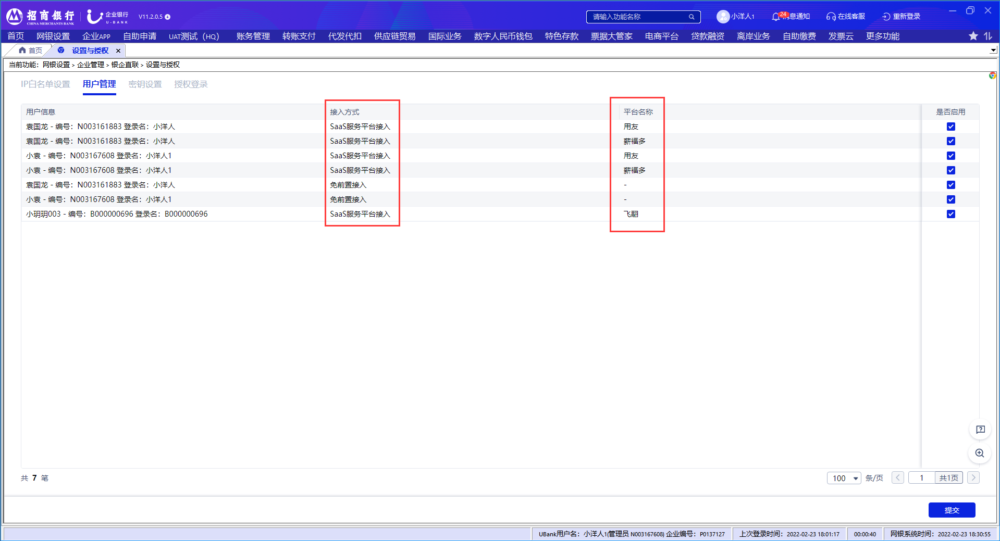

# 2.11免前置用户禁用启用

> 来源: 招行云直联文档中心 (bizkey=DCCT20201215110811035, 节点=2026070917153707272)
> 抓取: 2026-09-03T06:16:22.077Z

---

2.11免前置用户密钥启用 

管理员登录后，在 网银设置-企业管理-银企直联-设置与授权-用户管理 中根据用户信息及接入方式，操作列点击对应的按钮，选择需要进行禁用或启用操作的接入模式。

