# 2.1测试

> 来源: 招行云直联文档中心 (bizkey=DCCT20201215110811035, 节点=2026070917153721560)
> 抓取: 2026-09-03T06:16:22.122Z

---

2.1测试

客户明确了需要对接的业务和接口后，需要申请测试资源进行测试，企业可自行登录招商银行企业开放平台申请。也可由所在分行协助申请。

 1.测试资源申请流程 

 （1）企业开放平台网址 

https://openbiz.cmbchina.com/developer/UI/Business/CloudDirectConnect/Public/YqzlIndex.aspx

 （2）企业开放平台页面简介与注册 

页面简介：包含云直联业务介绍、下载中心（开发demo、前置机、密钥生成工具等）、云直联开发文档、申请测试等功能。

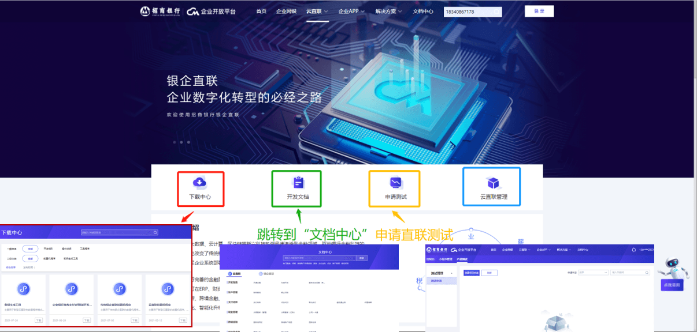

平台账号注册：

在企业开放平台首页点击右侧的登录，如果已有账号，直接输入账号密码登录；

如果没有则点击下方的“注册”按钮。注意手机号一定是招商银行预留号码；

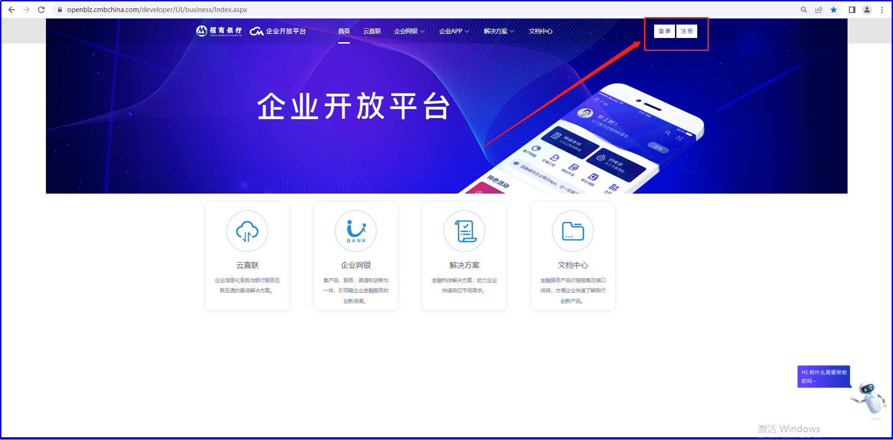

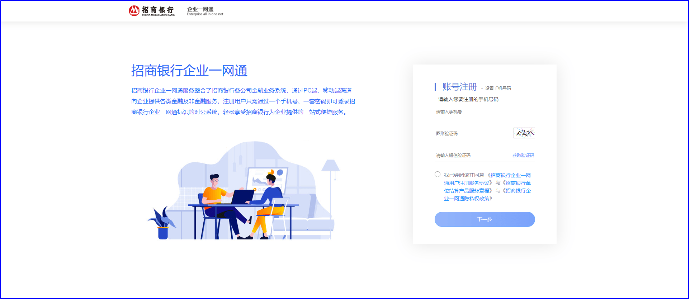

输入手机号码、图形验证码并勾选服务协议后，点击获取验证码并输入，然后点击下一步；

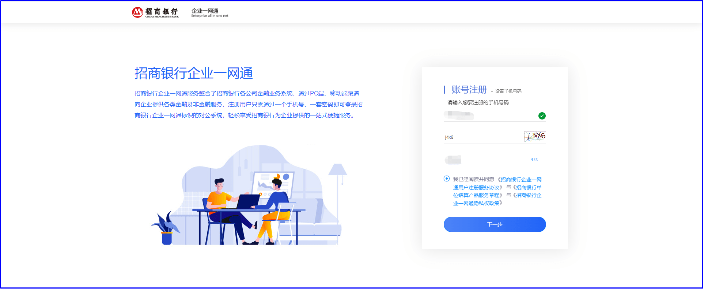

设置密码后，点击下一步，提示注册成功，点击完成后可以返回首页登录；

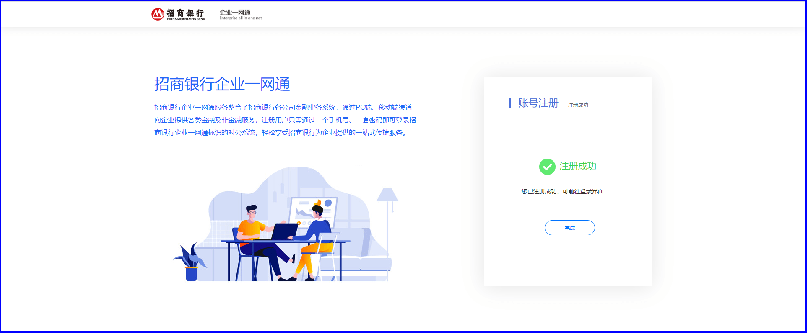

登录时，可以选择密码登录或者短信验证码登录。

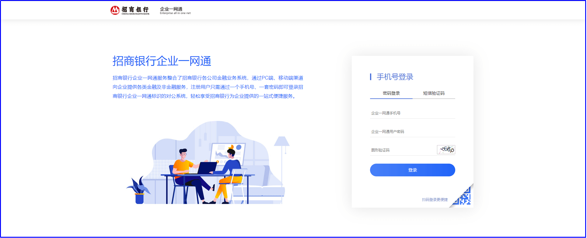

 （3）申请测试流程 

登录后，点击云直联-申请测试，进入企业开放平台后台，再进入测试管理，点击“创建项目申请”；

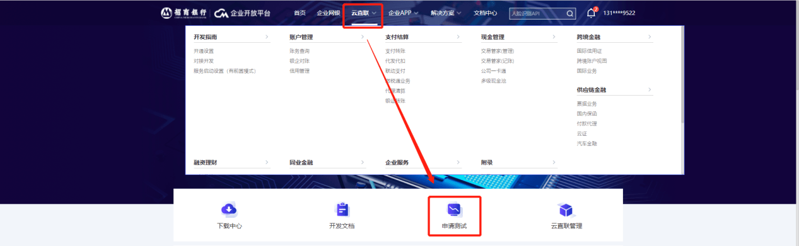

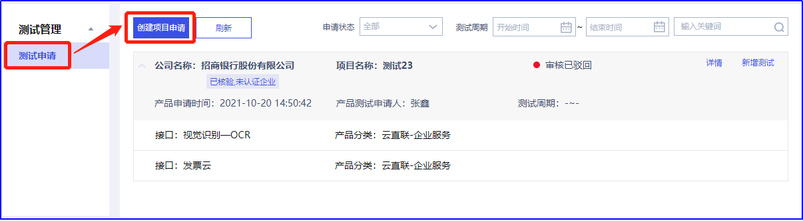

录入企业基本信息，点击下一步；

注意：此处的公司名称如果在企业APP已经关联，就可以自动带出统一社会信用代码且不能修改，如果没有，需要手动输入。

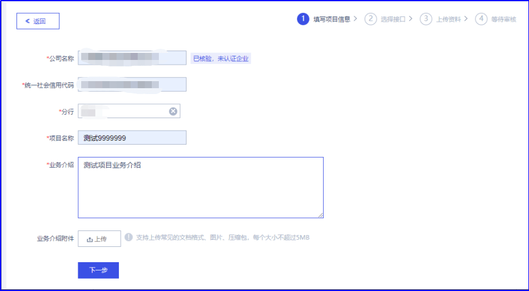

选择云直联模式；

依次选择产品测试周期、直联模式、企业系统互联网出口IP（测试环境）；

勾选待测试的功能接口，点击下一步（无须上传产品申请表）；

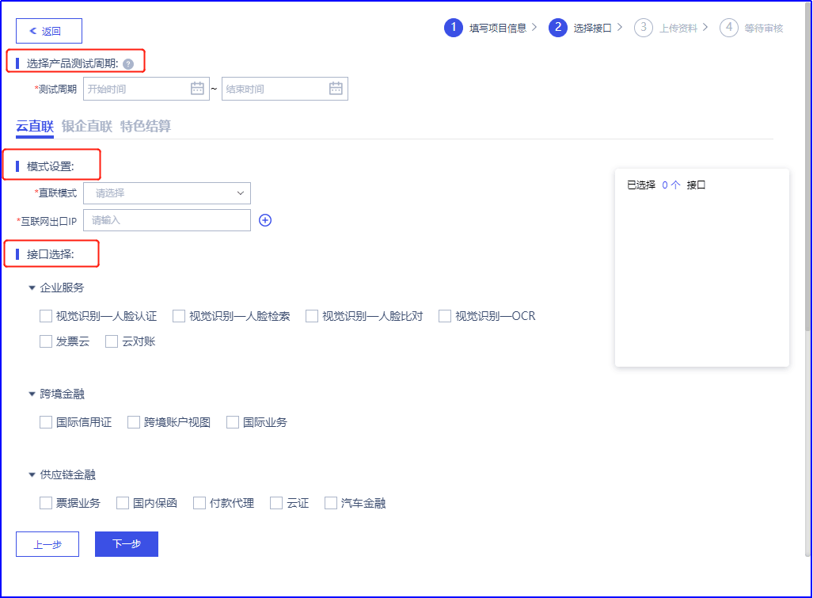

注意：云直联分为标准模式和SaaS模式，这里客户只需要选择标准模式对接（有前置/免前置）。

标准模式对接模式：

·“有前置有USB Key”是指客户需要在自身计算机系统中安装我行提供的前置机程序并通过我行颁发的企业数字证书（USB Key）进行登录和交易。

·“有前置免USB Key”是指客户需要在自身计算机系统中安装我行提供的前置机程序并通过我行企业网银或企业APP进行授权登录，且通过前置机程序与我行后台服务器进行密钥交换，后续通过云直联所发起的业务均通过该密钥进行加密、签名操作。

·“免前置”是指客户无需在自身计算机系统中安装前置机程序，但需要客户生成符合我行要求的密钥，并将生成的相关密钥通过我行企业网银或者企业APP等渠道上传，与招商银行后台服务器进行密钥交换，后续通过云直联所发起的业务均通过该密钥进行加密、签名操作。

招商银行云直联多种的接入方式为客户提供了更灵活的选择，支持企业客户云端轻量级部署。

注意：标准模式云直联支持银企直联渠道下全量产品功能。

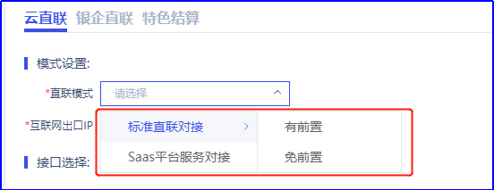

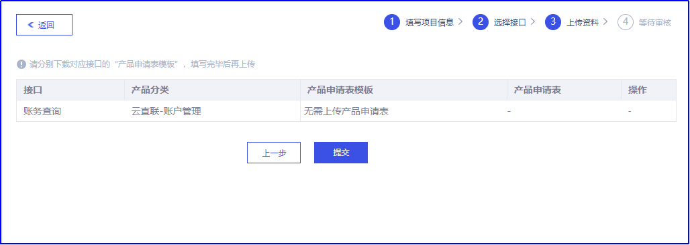

提交后，经过分行直联测试分行经办岗、直联测试分行审批岗以及直联测试总行配置岗等岗位审批配置后，用户可登录查看分配的测试资源参数。测试资源一般1个工作日内可以下发。

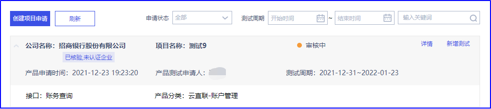

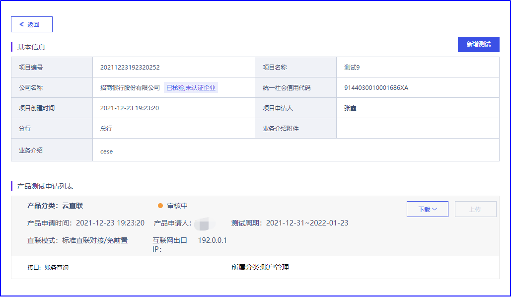

  2.提交测试报告 

 （1）下载测试报告模板 

测试完成后，需要编写测试报告。测试报告模板的下载也是在企业开放平台，找到待验收的申请记录，点击“详情”，在下载下拉按钮下选择测试验收模板下载，如下图；

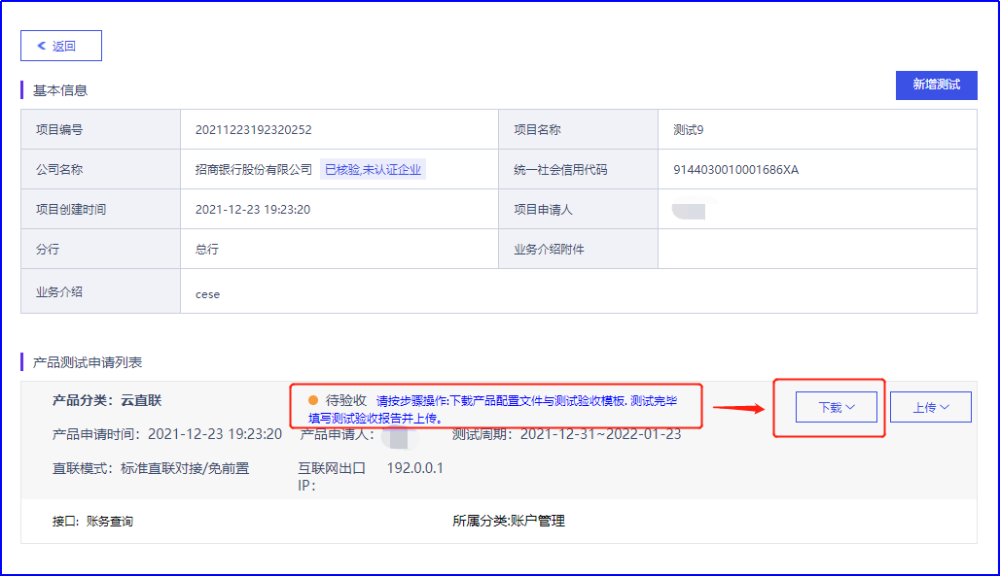

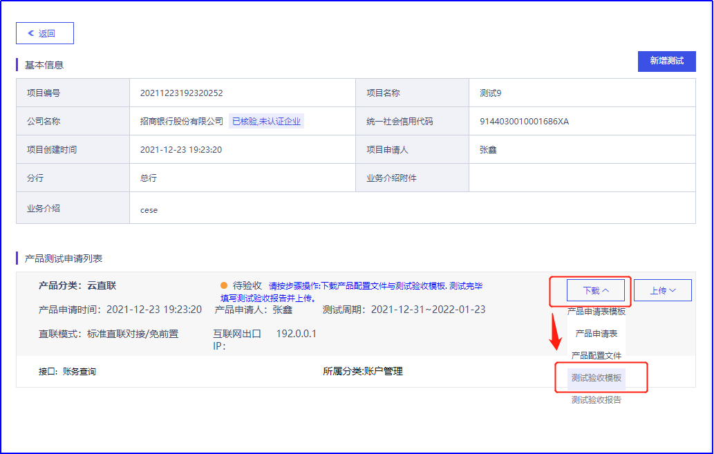

 （2）上传测试报告 

测试完成后，提交该项目的测试报告给技术支持工程师审核后，上传到企业开放平台。等待行内验收完成即可开通生产环境的业务功能，验收结果也在该页面进行查看。

注意：这里要上传真实的企业网银编号。

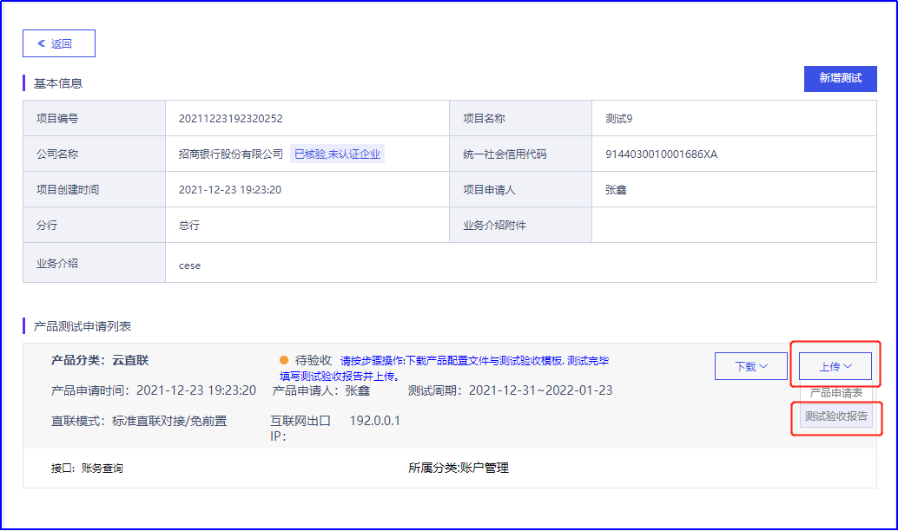

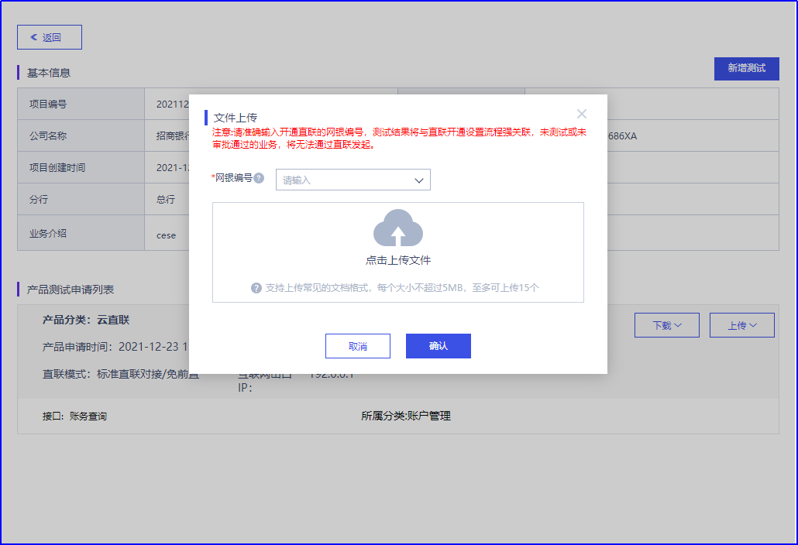
