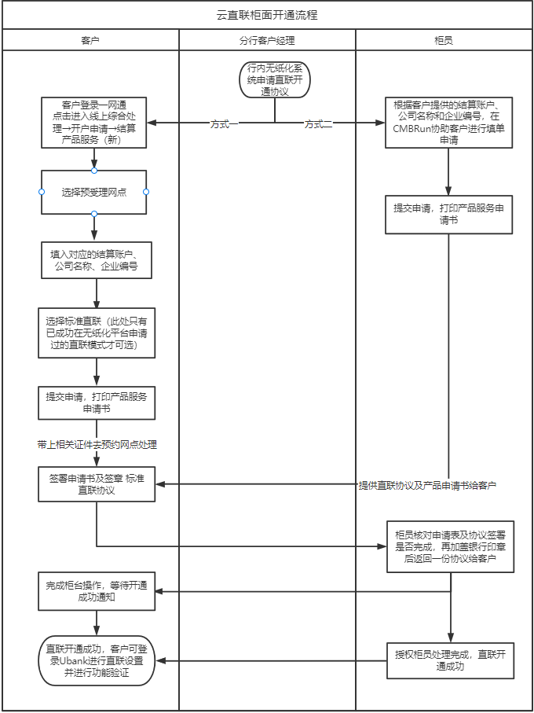

# 2.2.2柜台签约

> 来源: 招行云直联文档中心 (bizkey=DCCT20201215110811035, 节点=2026070917153705959)
> 抓取: 2026-09-03T06:16:22.056Z

---

2.2.2客户经理行内无纸化平台申请， 客户前往柜台签约 

由客户经理从无纸化为客户发起开通申请（客户经理手动输入月服务费、优惠区间、优惠后服务费）。审批完成后，客户经理通知客户完成线下协议签署，并 前往柜台 办理开通标准模式直联相关手续。

 柜面签约须携带相关材料 ：加盖单位公章及法定代表人（单位负责人）/授权代理人签章的《单位结算产品服务申请书》、 两份已完成签约的服务协议 、以及按照《招商银行网上“企业银行”运营操作规程》要求提交的其他申请资料；若服务申请书或服务协议为授权代理人签署的，还须提供授权书。

柜台开通流程如图：

