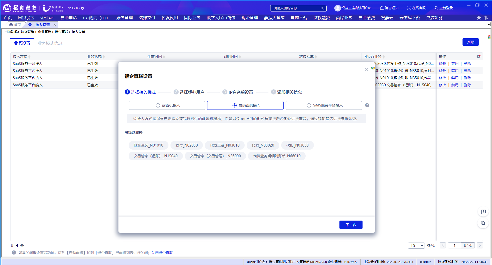
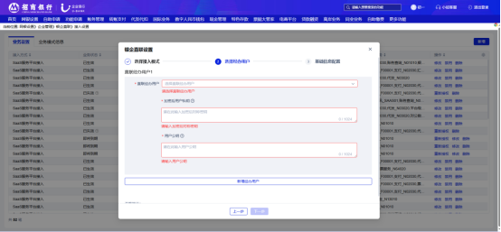
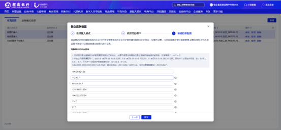
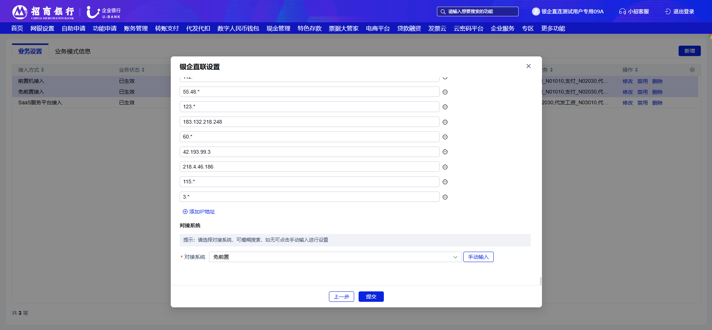
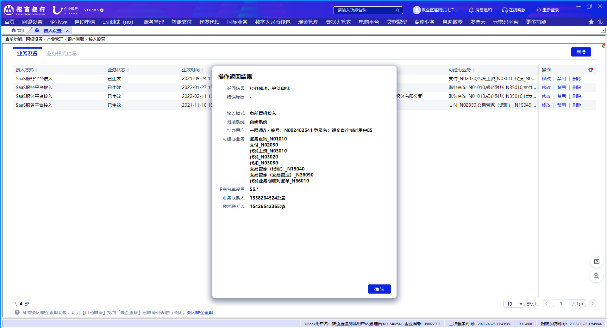
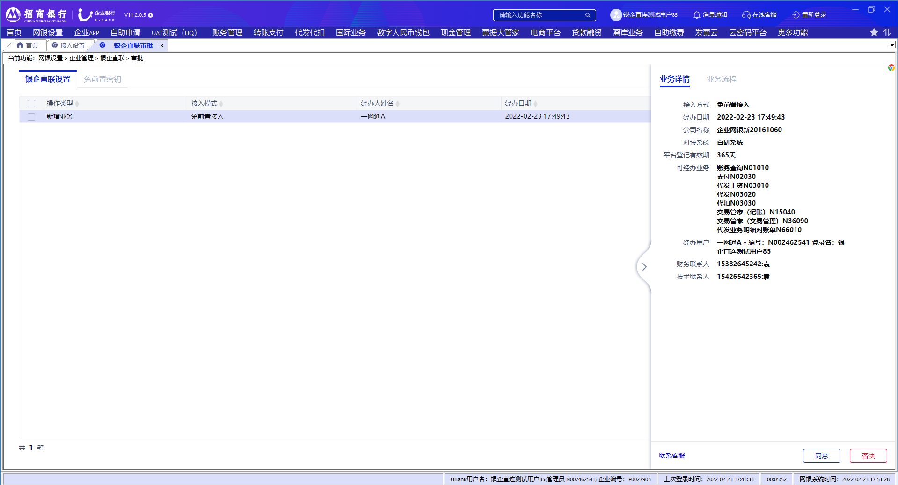

# 2.3设置

> 来源: 招行云直联文档中心 (bizkey=DCCT20201215110811035, 节点=2026070917153720799)
> 抓取: 2026-09-03T06:16:22.100Z

---

2.3设置 

在完成签约后，如果没有在签约过程中设置直联业务，则还需要在网银客户端进行相关设置，路径为 网银设置-企业管理-银企直联-接入设置 。单管理员设置完成后直接生效，双管理模式，还需要另一个管理员审批完成后生效。

（1）选择接入方式。签署标准模式协议，可以选择 前置机接入（支持有Ukey和免Ukey模式） 、 免前置机接入 两种接入方式， 注意该界面的可经办业务展示的是客户在企业开放平台申请测试且测试通过的业务，如客户没有进行测试将无法通过直联发起对应的业务请求。 

（2）选择经办人员。只有设置的经办用户，才能通过直联发起请求，同时设置每个用户对应的秘钥。

（3）配置IP地址，此处设置的IP为企业端的出口IP，如果是有前置则是前置软件所在机器的出口IP，不设置会导致发往银行的请求被拒绝；不设置可直接点击下一步，后续如有需要，可在 系统管理-银企直联设置-设置与授权-IP白名单配置 中进行配置。

（4）添加相关信息中，用户需要填写接入模式的对接系统信息，确认填写信息无误后，点击提交，提示经办成功，请通知各级审批人完成业务审批

（5）提交成功后，单管理员模式下设置成功，双管理员模式下需要另一管理员进行审批。另一管理员登录后，在“系统管理”-“银企直联管理”-“审批”页面，点击银企直联设置，可查询到待审批数据并进行同意或者否决操作。

