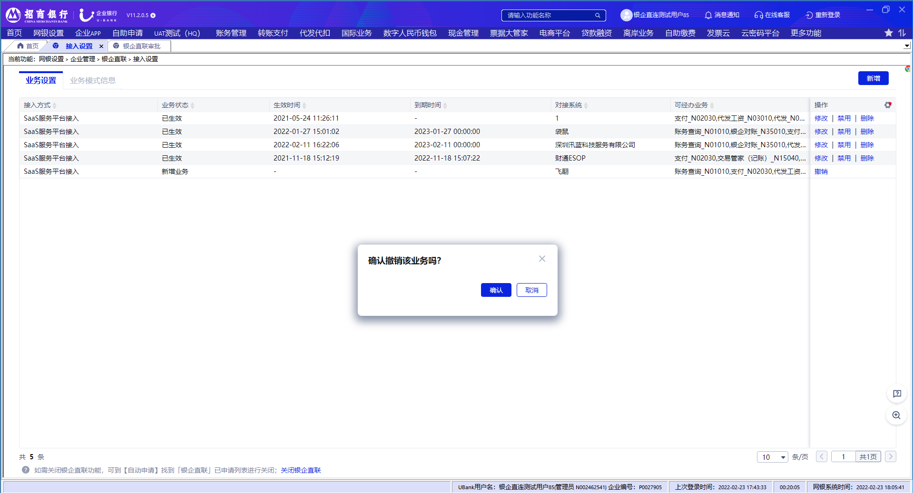

# 2.4撤销

> 来源: 招行云直联文档中心 (bizkey=DCCT20201215110811035, 节点=2026070917153798106)
> 抓取: 2026-09-03T06:16:22.404Z

---

2.4撤销 

双管理员模式下，管理员发起设置或者新增修改申请后，而且另一个管理员还没有审批，如果想撤回申请，可通过 网银设置-企业管理-银企直联-接入设置 菜单，点击撤销按钮，撤回还未审批的申请。

