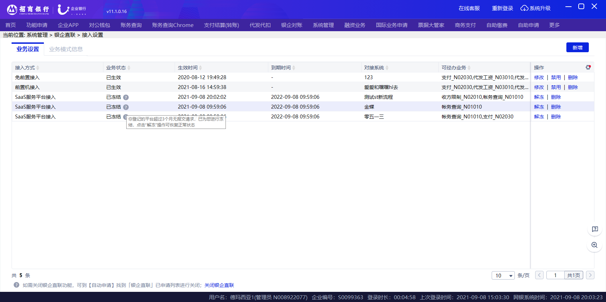
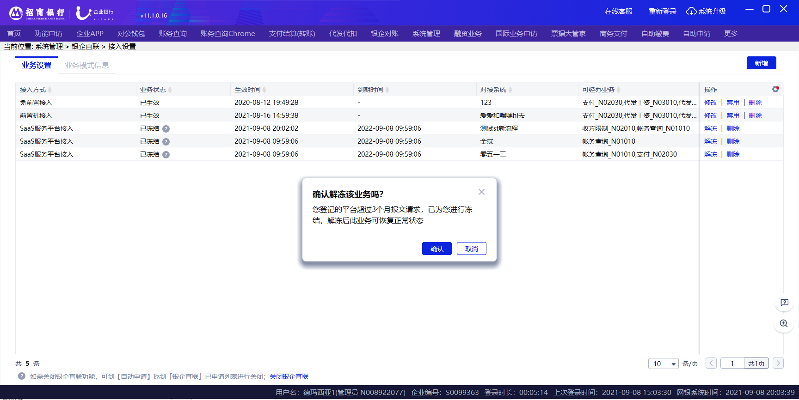
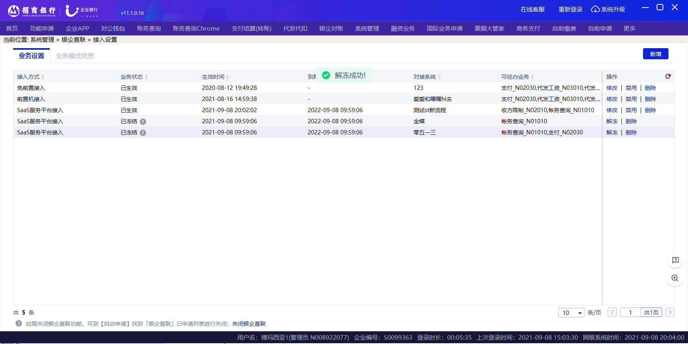

# 2.5冻结

> 来源: 招行云直联文档中心 (bizkey=DCCT20201215110811035, 节点=2026070917153771017)
> 抓取: 2026-09-03T06:16:22.317Z

---

2.5冻结 

银企直联接入模式超过三个月没有发送报文请求后，系统会暂时冻结对应的接入模式，冻结状态下无法发送报文请求。

点击解冻可直接解除接入模式的冻结状态，无需审批。解冻后相关功能可正常使用。

