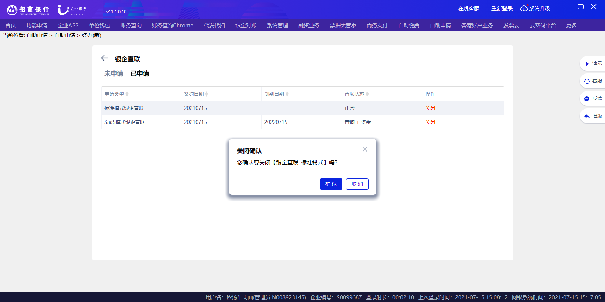

# 2.6关闭

> 来源: 招行云直联文档中心 (bizkey=DCCT20201215110811035, 节点=2026070917153735988)
> 抓取: 2026-09-03T06:16:22.144Z

---

2.6关闭 

如使不再用银企直联，管理员登录后进入 自助申请-其他-银企直联-已申请 菜单，点击关闭银企直联按钮，双管理使用需另一个管理员审批后生效（网银首页通知待办入口进入审批界面），单管理员直接生效。

