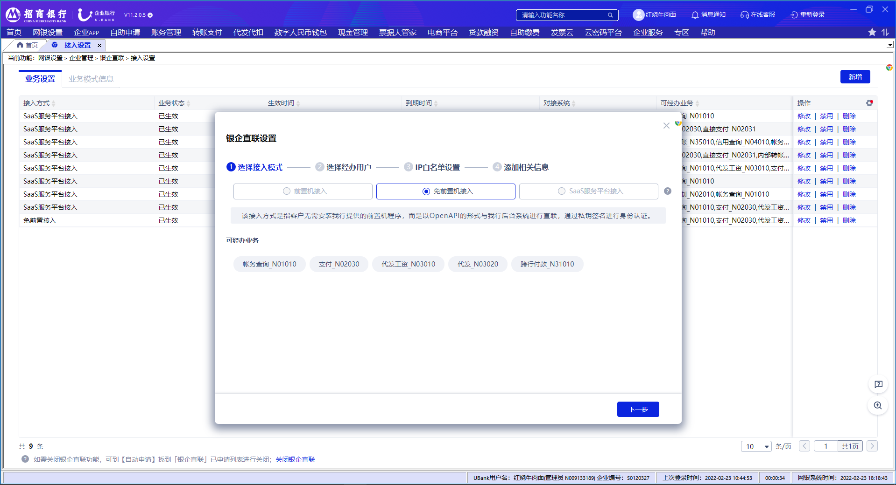
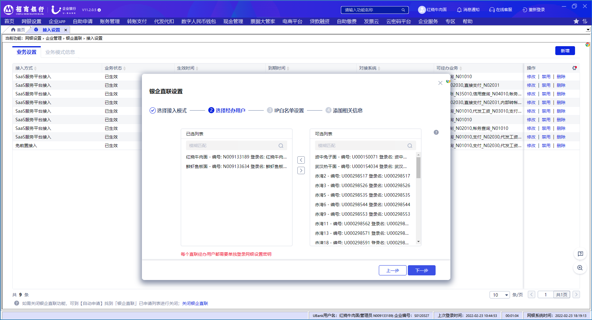
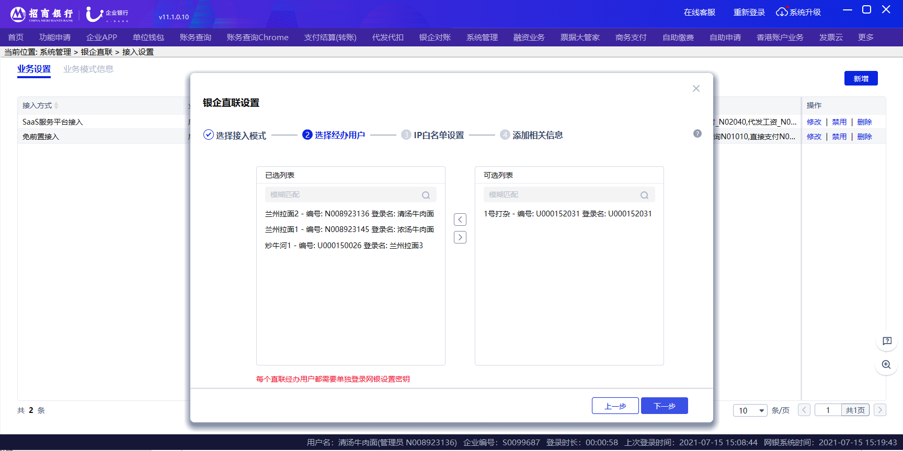

# 2.7设置修改

> 来源: 招行云直联文档中心 (bizkey=DCCT20201215110811035, 节点=2026070917153755217)
> 抓取: 2026-09-03T06:16:22.273Z

---

2.7设置修改 

管理员登录后，在 网银设置-企业管理-银企直联-接入设置 菜单点击修改按钮，弹出修改弹窗，修改数据后点击提交按钮。若是双管理员需另一管理员复核后生效，单管理员直接生效。

标准模式接入方式修改，流程同新增设置(见2.3)

