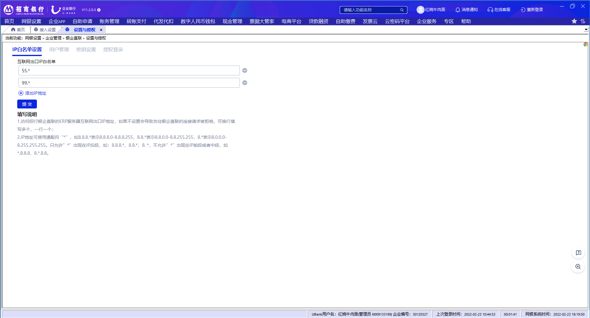

# 2.8企业互联网出口IP白名单设置

> 来源: 招行云直联文档中心 (bizkey=DCCT20201215110811035, 节点=2026070917153796694)
> 抓取: 2026-09-03T06:16:22.381Z

---

2.8企业互联网出口IP白名单设置 

在 系统管理-银企直连管理-设置与授权-IP白名单设置 ”菜单，点击添加IP地址，可新增IP地址，点击IP地址后的减号图标可以删除IP地址，点击提交后生效。

（1）此处设置的IP为企业端的出口IP，如果是有前置则是前置软件所在机器的出口IP，如果是免前置则是企业ERP软件的出口IP，如果不设置会导致发往银行的请求被拒绝.；

（2）IP地址可使用通配符“*”，如8.8.8.*表示8.8.8.0-8.8.8.255，8.8.*表示8.8.0.0-8.8.255.255，8.*表示8.0.0.0-8.255.255.255。只允许”*”出现在IP后段，如：8.8.8.*、8.8.*、8. *，不允许”*”出现在IP前段或者中段，如*.8.8.8、8.*.8.8。

