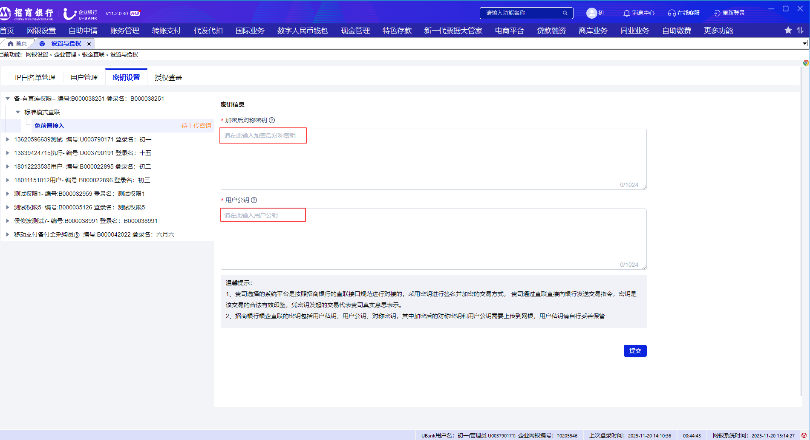
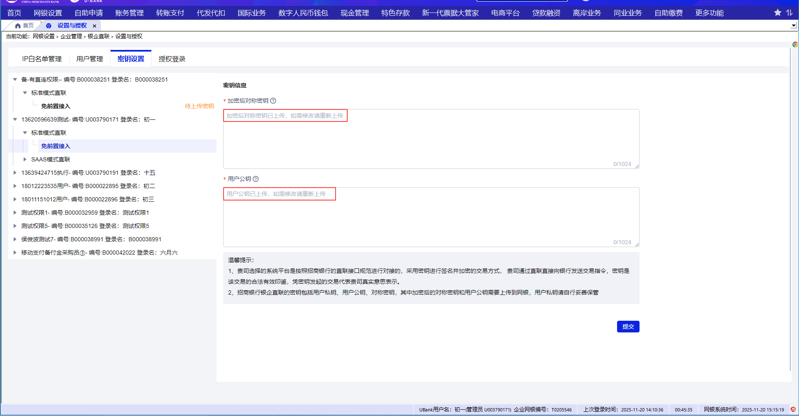

# 2.9免前置密钥设置

> 来源: 招行云直联文档中心 (bizkey=DCCT20201215110811035, 节点=2026070917153738742)
> 抓取: 2026-09-03T06:16:22.187Z

---

2.9免前置密钥设置 

如果客户设置的是免前置接入方式，在接入前，需要该用户进入免前置密钥设置页面上传密钥信息，上传的密钥包括加密后的用户对称密钥和用户公钥，密钥生成可以参见免前置开发对接流程章节中的密钥生成章节描述。

免前置用户登录网银后在 网银设置-企业管理-银企直联-设置与授权-密钥设置 菜单，选择密钥设置，在对应的对称密钥和公钥的文本框中输入密钥和公钥，点击提交。密钥和公钥上传后需要管理员进行审批方可生效，如果该用户是单管理员操作则直接调用数字签名后生效，如果是双管理员则需要另一个管理员审批后生效。如果是普通用户则任意一个管理员审批方可生效。

 注意：每个免前置经办用户都需要在网银上传密钥，可以用户登录后自己上传，也可以由网银管理员替经办用户上传密钥。免前置接入密钥是客户身份识别和通讯安全的基础，请妥善保管，当发现密钥有泄露风险时请重新生成密钥后上传。SaaS模式云直联在协议到期进行续约的时候应同步更新密钥，否则会影响使用。 

已上传密钥提示。

 密钥上传后请联系企业管理员用户进行审批，如果该当前用户是单管理员操作则直接调用数字签名后生效，如果是双管理员则需要另一个管理员审批后生效。如果是普通用户则任意一个管理员审批方可生效。
