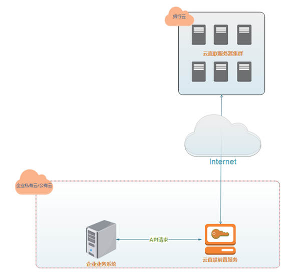

# 3.前置客户端对接开发流程

> 来源: 招行云直联文档中心 (bizkey=DCCT20201215143758097, 节点=2026082616101569770)
> 抓取: 2026-09-03T06:17:44.268Z

---

3.前置客户端对接开发流程

步骤：

 用户需要先在云直联前置服务上使用企业一网通用户登录。 

 (1)&nbsp;客户根据报文规范章节说明组织请求报文，采用POST表单的方式发送到云直联前置服务。 

 请求示例如下： 

UID=N002432758&amp;DATA= 

{

 "request": {

 "head": {

 "funcode": "DCDACCYE",

 "userid": "N002432758"

 },

 "body": 

 …………… //见具体API接口说明

 }

 }

}

UID：企业网银用户ID（需和请求报文head里面的userid保持一致），在云直联客户端的登录信息可以查看到。

DATA：报文内容（参见报文规范） 。 需要对其进行URLEncode

 发送地址为前置机软件安装所在电脑的地址，端口为前置机软件系统设置里面设置的端口。 

 云直联前置服务同步返回结果给用户。
