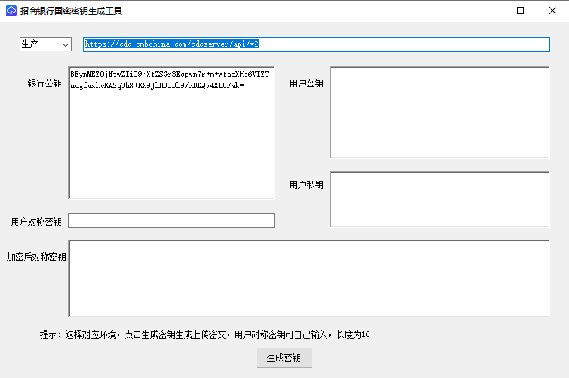

# 4.1密钥生成

> 来源: 招行云直联文档中心 (bizkey=DCCT20201215143758097, 节点=2026082616101581542)
> 抓取: 2026-09-03T06:17:44.311Z

---

4.1密钥生成 

通过免前置接入方式必须先上传密钥信息。请使用下面工具生成密钥。选择(生产)，点击生成密钥

 密钥工具下载： 

 https://openbiz.cmbchina.com/developer/UI/Business/CloudDirectConnect/Public/DownLoadCenter/DownloadTransfer.aspx 

运行密钥生成工具，生产环境左上角下拉框选择生产，点击生成密钥，会生成如下4个密钥：

a.&nbsp;对称密钥：客户自己保存，用户报文加密、解密使用，请妥善保管，防止泄露。

b.&nbsp;加密后对称密钥：上传到银行，见开通设置模块2.10免前置密钥设置描述。

c.&nbsp;用户（SM）公钥：上传到银行，见开通设置模块2.10免前置密钥设置描述。

d.&nbsp;用户（SM）私钥：客户自己保存，对请求报文进行签名时使用，请妥善保管，防止泄露。

银行公钥也可以通过下面链接获取，用于银行返回报文验签：

 测试环境： 

http://cdctest.cmburl.cn/cdcserver/getPublicKeyGM.jsp

 生产环境： 

https://cdc.cmbchina.com/cdcserver/getPublicKeyGM.jsp
