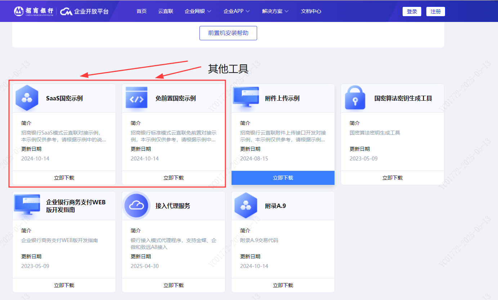

# 5.示例代码

> 来源: 招行云直联文档中心 (bizkey=DCCT20201215143758097, 节点=2026082616101542446)
> 抓取: 2026-09-03T06:17:44.204Z

---

5.示例代码

以下链接提供示例代码，包含免前置/SaaS对接，支持Java、C#、nodejs、Php、Python开发语言。示例仅供参考，请勿直接使用。

https://openbiz.cmbchina.com/download-center

