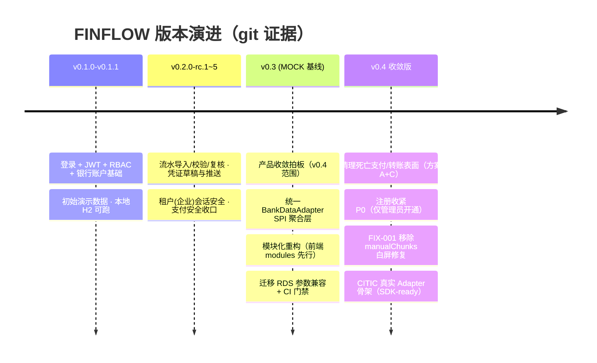
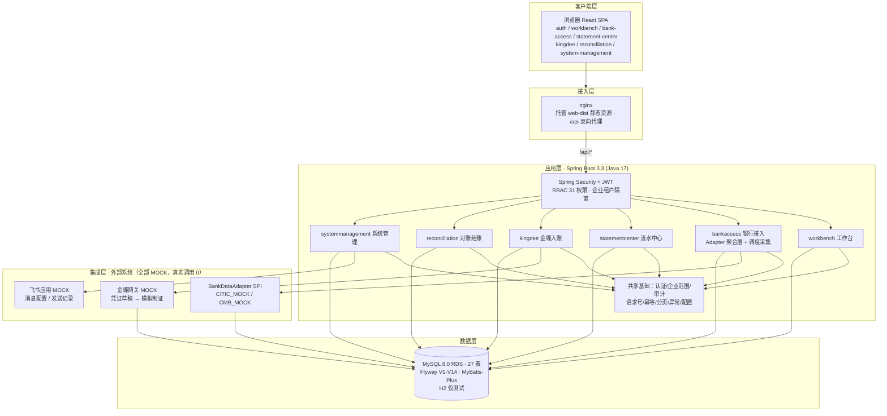

# FINFLOW 项目全景图

> 快照日期：2026-09-03 ｜ 基线：v0.3 MOCK（模块化结构基线）→ v0.4 产品收敛版 ｜ 维护：WB + 全栈工程师（双对话协作）
> 权威来源：`tech-architecture.md`（架构）· `function-points.md`（功能）· `v0.3-module-architecture.md`（模块边界）· `bank-connect-schedule-2026-09-03.md`（排期）· `deployment-aliyun-2026-09-02-noconsole.md`（部署）
> 本文同时托管于飞书云文档，同步源即本文件。

## 1. 一句话定位与关键数字

**FINFLOW 是企业财务数据治理平台**：银行流水「采数 → 校验 → 复核 → 制证 → 对账 → 结账」的全链路受控工作台。真实银行/金蝶/飞书接入处于排期中，当前全部走 MOCK，页面均标注「模拟数据」——**外部真实调用计数为 0**。

| 维度 | 数字 |
|---|---|
| 产品范围 | v0.4 收敛版：6 大业务模块 + 共享基础；支付/转账/调拨已砍（V14 权限退休） |
| 代码形态 | 前后端分离：Spring Boot 3.3 (Java 17) + React 18 SPA；Maven + Vite 构建 |
| 数据 | 生产 MySQL 8.0 RDS · 27 表 · Flyway V1–V14 已应用（新迁移自 V15 起） |
| 权限 | RBAC · 31 项权限目录 · 企业（租户）级数据隔离 |
| 银行数据 | 五类只读查询（余额/流水/回单/对账单/代发）· 原始报文 30 天保留后清理 |
| 运行 | ECS `101.200.72.87` · Docker Compose 双容器（app + nginx）· 容器自愈 healthcheck |
| 外部接入 | 中信/招行/金蝶/飞书 4 路，全部 MOCK；真实联调按 9 月排期推进 |

## 2. 技术路径（版本演进）



| 阶段 | 要点 | git 证据 |
|---|---|---|
| v0.1.x | 登录/JWT/RBAC、银行账户、初始数据 | tag `v0.1.0` `v0.1.1` |
| v0.2.0-rc.x | 流水校验复核、凭证推送、租户隔离、会话安全、支付安全收口 | tag `v0.2.0-rc.1~5`、`a394e72` |
| v0.3 模块化基线 | **产品收敛**（支付/调拨出范围 `462cacb`）；**统一银行 Adapter 聚合层** `dc45572`（端到端追溯）；**模块化重构** `fdba1b4`（前端 navigation 先行）；**RDS 参数兼容迁移 + CI 模拟门禁** `f713d92`；清理死亡表面（方案 A+C）`497c057` | `e10c2c9` 服务重打包 + JaCoCo |
| 安全 P0 | 关闭公开自助注册，register 仅管理员（`3800b02`）——生产收敛验证：匿名 POST `/api/auth/register` 应 401 | — |
| FIX-001 | 移除 vite manualChunks 手工分桶，修复登录页白屏（`c268f38`，已上线并人工复核通过） | `ffcda57` 回填闭环 |
| v0.4 收敛版 | CITIC 真实 Adapter 骨架（`b7622f8`，dlink SDK-ready）；部署 healthcheck + nginx `.inc` 挂载修复（`da85b35`）；12 份过时文档退休 + 功能/架构文档重建（`7b7e06b`） | — |

## 3. 技术栈选择

| 层 | 选型 | 版本 | 选择理由（一句话） |
|---|---|---|---|
| 前端框架 | React 18（函数组件+Hooks）+ TypeScript | 18.3.1 / TS 5.8.3 | 生态成熟、类型安全，配合 antd 5 出企业后台快 |
| 构建 | Vite | 5.4.19 | 冷启动/构建快；**已移除 manualChunks 手工分桶**（FIX-001 白屏根因，回归默认分包） |
| UI / 路由 / 状态 / HTTP | Ant Design 5 / react-router-dom 6 / zustand 5 / axios | 5.26.7 / 6.30.1 / 5.0.5 / 1.10 | antd 企业组件完备；zustand 轻量无样板 |
| 后端框架 | Spring Boot 3（web/security/validation） | 3.3.13 | 企业级标准；3.x 对齐 Jakarta |
| 语言 | Java | 17 | LTS；与 Spring Boot 3 匹配 |
| ORM | MyBatis-Plus（多租户/分页） | 3.5.9 | 内置租户插件与分页，贴合企业隔离需求 |
| 迁移 | Flyway（flyway-core + flyway-mysql） | — | 版本化迁移，启动自动执行；V1–V14 已应用不可改 |
| 数据库 | 生产 MySQL 8.0（阿里云 RDS）/ 测试 H2 | RDS 8.0.36 | 生产云上托管免运维；H2 加速本地/CI |
| 认证 | JWT（jjwt）+ Spring Security | 0.12.6 | 无状态会话，适配前后端分离 |
| 接口文档 | Knife4j OpenAPI3 | 4.5.0 | 内嵌 `/doc.html`，联调自助 |
| 质量 | JaCoCo / ESLint + typescript-eslint | 0.8.12 / 10.x | 覆盖率门禁 + 前端静态检查 |
| CI | GitHub Actions | — | Maven 单测 + **RDS 参数组合 mysql:8.0 镜像模拟迁移门禁**（防裸 TIMESTAMP 1067） |
| 部署 | Docker Compose 双容器 + nginx | app: temurin 17-jre / nginx 1.27-alpine | 双容器隔离；nginx 托管静态 + 反代 `/api`；healthcheck 自愈 |

## 4. 系统架构

### 4.1 分层视图（MOCK 基线）



### 4.2 六大业务模块

| 模块 | 后端归属 | 前端归属 | 核心职责 |
|---|---|---|---|
| 工作台 | `workbench` | `modules/workbench` | 采集/复核/入账/差异/结账摘要（待办优先） |
| 银行接入 | `bankaccess` | `modules/bank-access` | 连接配置、账户、每日定时采集 + 手动补采、任务状态（8 态状态机）、监控 |
| 流水中心 | `statementcenter` | `modules/statement-center` | 导入批次、标准流水、校验（VALID/INVALID/DUPLICATE/PENDING_REVIEW）、人工复核（复核人≠导入人） |
| 金蝶入账 | `kingdee` | `modules/kingdee` | 科目/往来映射规则、凭证草稿、模拟制证、失败重试（幂等防重复建证） |
| 对账结账 | `reconciliation` | `modules/reconciliation` | 银行/FINFLOW/金蝶三方核对、账期检查与结账闸口 |
| 系统管理 | `systemmanagement` | `modules/system-management` | 用户/角色/企业/飞书/审计/系统设置 |

共享基础（`common`）：认证与租户隔离、RBAC、审计、请求号、幂等、分页、统一异常——**共享层不得反向依赖业务模块**。实体/Mapper 当前集中管理（跨模块公共访问 + 固定 Flyway 顺序），后续按领域归档（v0.3 收尾项）。

### 4.3 银行数据单向链路（红线）

```text
Adapter 调用(定时/手动) → 原始请求/响应 + 同步日志(REQUIRES_NEW 先落库)
→ 统一模型转换/投影 → 业务表/查询投影 → FINFLOW API → 前端展示
```

- 链路**单向**：原始报文、同步日志全文、银行专有字段、凭据、内部堆栈**不进入**页面/浏览器缓存/导出/前端类型。
- 转换/投影失败仍可按 `request_id` 追溯；重复触发不产生重复业务事实（幂等键 + 并发锁 + TASK_REUSED 审计）。

## 5. 功能清单（按状态）

> 图例：✅ 已建（MOCK 口径可验证）｜ 🟡 收敛/占位｜ ⏳ 排期中｜ ◻️ 远期｜ 🚫 范围外

| 域 | 已建 ✅ | 收敛/占位 🟡 | 排期 ⏳ / 远期 ◻️ | 范围外 🚫 |
|---|---|---|---|---|
| 登录会话 | 登录/登出、管理员开通（注册已关）、`/auth/me` 权限菜单 | — | ◻️ 首登强制改密/自助改密 | — |
| 工作台 | 处理概览（待办数字汇总） | — | ◻️ 待办分项下钻 | — |
| 银行接入 | 连接管理、签约准备、账户 CRUD、每日定时采集、手动补采、任务/监控/失败日志、五类只读查询、原始数据 30 天留痕清理 | — | ⏳ 中信真实直联（红线 9/10，排期 9/18）；⏳ 招行同上 | 支付记录查询（另立需求） |
| 流水中心 | 导入、标准流水、数据校验、人工复核、规则与映射管理（版本化激活） | — | ◻️ 去重降级规则界面化 | — |
| 金蝶入账 | 凭证草稿与模拟制证、入账结果/重试、高风险转人工 | — | ⏳ 真实网关替换 Mock（9/5 提交申请，9/11 联调） | — |
| 对账结账 | 三方对账总览、账期检查与结账 | — | ◻️ 差异逐条处理闭环 | — |
| 协同通知 | 飞书连接配置（MOCK）、接收对象与通知策略、发送记录/重试、事件触发面 | — | ⏳ 飞书真实应用接入（需管理员授权） | — |
| 系统管理 | RBAC 31 权限强制、企业隔离、审计中心 | 🟡 用户/角色管理前端占位（后端完整保留，待 UI 恢复决策） | ⏳ 试用账号/角色/权限分配（9/18 前）；◻️ 企业管理页面 | — |
| 平台底座 | MOCK Adapter 统一聚合层、定时调度与重试韧性、Flyway 迁移体系 | — | ◻️ 实体/Mapper 领域归档 | 转账/付款/调拨/支付审批执行（V14 权限退休）、BI/低代码报表、总账替代、税务发票、多币种、SSO |

## 6. 外部系统接入排期（v1.2 一页纸）

| 接入对象 | 备战 | 红线 | 联通/联调 | 里程碑 |
|---|---|---|---|---|
| 中信（流水/余额） | SDK 四件套盘点 | 白名单红线 **9/10** | ✅ **9/18** 联通 + 联调报告 | M1 9/18 三方联通 · M2 9/23 测试&试用 · **M3 9/30 生产级使用** |
| 招商（流水/余额） | 骨架 + CI 契约测试 | 同上 | ✅ **9/18** | 同上 |
| 金蝶（凭证/入账） | **9/5 前提交** OpenAPI 开通申请 | — | ✅ **9/11** 联调（凭证入测试账套） | 同上 |
| 部署/权限/试用账号 | 出向网络清单 9/8 | — | ✅ **9/18** 前完成（31 项权限分配） | 同上 |

外部依赖：银行测试包+白名单（9/10 红线）、金蝶应用审核（9/5）、公司管理员安全组/证书（9/16 前提早申请，部署手册 §1 六件事）。

## 7. 部署拓扑与运维要点

| 项 | 现状 |
|---|---|
| 服务器 | 阿里云 ECS `101.200.72.87`（Debian 12，SSH 密码登录）；**无控制台/安全组权限**（公司账号） |
| 数据库 | RDS 内网 `rm-2zezxf5vds35q5x92.mysql.rds.aliyuncs.com`（8.0.36），仅 ECS 内网可达 |
| 运行 | Docker Compose：`finflow-app`（8080 仅容器内）+ `finflow-web`（80/443）；healthcheck + restart 自愈 |
| 关键配置 | nginx location 片段挂 `conf.d` 之外（`.inc`，避 `*.conf` http 顶层 [emerg]）；web-dist 以 bind mount 挂载 |
| 迁移 | Flyway 启动自动执行；RDS 参数 `explicit_defaults_for_timestamp=OFF`+NO_ZERO_DATE → 裸 TIMESTAMP 非法，新迁移必须显式 DEFAULT |
| 发版门禁 | 交付附 **MD5 清单 + 构建时间 + commit**；线上/本地双核对；先 `.bak` 备份再替换（回滚弹药不删）；三层验收：服务器 curl → 公网 curl+401 → **浏览器级 console 零错误** |
| 0 基础维护 | 见 `maintenance-sop.md`（日常巡检/前端热替换/后端更新/回滚，全流程带预期输出） |

## 8. 关键设计决策速记

| 决策 | 结论 | 依据 |
|---|---|---|
| 支付/转账/调拨 | **范围外**，v0.4 已砍，V14 权限退休；历史表保留兼容无导航 | `function-points.md` §十二 |
| 银行扩展主轴 | 统一 `BankDataAdapter` SPI + 聚合层（路由/转换/状态映射/异常隔离/幂等），非平台化 | `v0.3-module-architecture.md` §6 |
| 真实外部调用 | 红线：SDK 未通过准入前 Adapter 必须快速失败（501/FAILED），**不得回退成成功**；真实调用计数必须为 0 | `tech-architecture.md` §3.4 |
| 前端构建 | 不用 manualChunks 手工分桶（FIX-001 白屏根因，已回退并加注释防回归） | `pending-fixes.md` |
| 注册入口 | 公开注册已关，仅管理员开通（P0，`3800b02`）；生产验证 = 匿名 register 401 | 同上 |
| 安全提示 | 登录失败不暴露账号可枚举信息；越权 401/403 且不泄露资源存在性 | `function-points.md` §一 |
| 迁移纪律 | V1–V14 已应用不可改（防 Flyway checksum 冲突）；CI 已模拟 RDS 参数门禁 | 工作区记忆 |

## 9. 当前待办 / 风险

| 优先级 | 事项 | 状态 |
|---|---|---|
| P0 | 注册收紧生产验证：匿名 `POST /api/auth/register` 应 401 | 代码已合（`3800b02`），线上以实测为准 |
| P1 | §8 浏览器验收剩余项（租户隔离抽查、容器自愈、重启不重复迁移） | 待做 |
| P1 | RDS 自动备份确认（保留 ≥7 天）+ 版本复核 | 需公司管理员 |
| P1 | 真实接入红线：银行白名单 9/10、金蝶申请 9/5、联调 9/11/9/18 | 排期推进中，外部依赖 |
| P2 | HTTPS 正式证书（需管理员）；自签过渡可评估 | 待决策 |
| 收尾 | 实体/Mapper 领域归档、用户管理 UI 恢复决策、对账差异闭环口径 | v0.3/v0.4 收尾 |

## 10. 文档地图（docs/）

| 文档 | 用途 |
|---|---|
| `tech-architecture.md` | 技术架构总览（本图 §3/§4 权威来源，含 Mermaid 分层图） |
| `function-points.md` | 按用户使用逻辑的功能状态清单（✅/⏳/🚫 全量） |
| `v0.3-module-architecture.md` | 模块边界与迁移方案（六大模块命名权威来源） |
| `bank-connect-schedule-2026-09-03.md` | 全系统接入排期一页纸（M1/M2/M3 里程碑） |
| `permission-catalog.md` | 31 项权限目录 |
| `deployment-aliyun-2026-09-02-noconsole.md` | 生产部署权威手册（命令输出对照 + §11 排障实录） |
| `maintenance-sop.md` | 0 基础维护 SOP（日常巡检/发版/回滚） |
| `pending-fixes.md` | 部署侧登记 → 全栈侧修复回填的待修清单 |
| `product-requirements.md` | v0.4 PRD（范围收敛依据） |
| `ui-specification.md` / `quality-security-checklist.md` | UI 规范 / 质量安全清单 |

---

*维护提示：功能与接入状态会随排期推进变化，飞书侧文档由部署工程师（WB）从本文件同步更新；重大变更需同步刷新 §5/§6/§9。*
