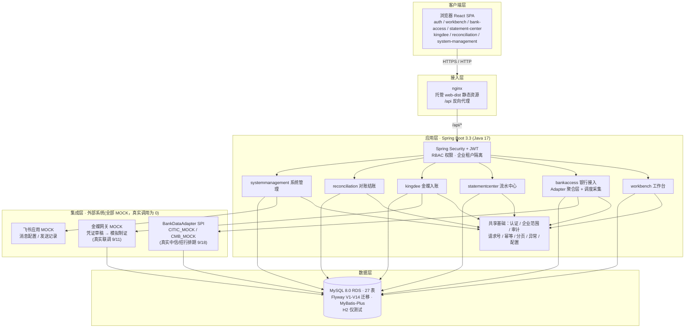

# FINFLOW 技术架构总览

> 状态：当前有效（v0.3 模块化基线）｜ 编写：WB · 2026-09-03
> 配套文档：模块化方案见 `v0.3-module-architecture.md`，功能清单见 `function-points.md`，部署见 `deployment-aliyun-2026-09-02-noconsole.md`

## 1. 分层架构图

## 2. 技术栈速览

| 层 | 选型 | 版本/备注 |
| --- | --- | --- |
| 前端框架 | React 18（函数组件 + Hooks） | 18.3.1 |
| 前端语言 | TypeScript | 5.8.3 |
| 构建 | Vite（已移除 manualChunks 手工分桶） | 5.4.19 |
| UI | Ant Design 5 | 5.26.7 |
| 路由 / 状态 / HTTP | react-router-dom 6 / zustand 5 / axios | — |
| 后端框架 | Spring Boot 3（web/security/validation） | 3.3.13 |
| 后端语言 | Java | 17 |
| ORM | MyBatis-Plus（多租户/分页） | 3.5.9 |
| 迁移 | Flyway | V1-V14 已应用，新迁移自 V15 起 |
| 数据库 | MySQL 8.0（生产 RDS）/ H2（测试） | RDS 8.0.36 |
| 认证 | JWT（jjwt）+ Spring Security | 0.12.6 |
| 接口文档 | Knife4j OpenAPI3 | 4.5.0 |
| 代码质量 | JaCoCo 覆盖率 / ESLint + typescript-eslint | 0.8.12 / 10.x |
| 构建/CI | Maven + GitHub Actions（含 RDS 参数模拟迁移门禁） | — |

## 3. 分层说明

### 3.1 客户端层
纯静态 SPA，无服务端渲染。页面按业务域拆到 `frontend/src/modules/*`（navigation 持久化菜单、dashboard 工作台、statement-center、bank-access、kingdee、reconciliation、system-management、audit 等）。前端**只调用 FINFLOW API**，不接触银行/金蝶原始报文。

### 3.2 接入层
nginx 一职双责：托管前端构建产物 `web-dist` + 将 `/api/*` 反代到后端。线上为 IP + HTTP 起步，HTTPS 见部署手册 §9。

### 3.3 应用层
- **认证与隔离**：Spring Security + JWT（无状态）；匿名仅开放登录；RBAC 权限点 + **企业租户数据隔离**（跨企业数据不可见）。
- **业务模块**：六大产品域（对应 v0.3 模块边界），应用服务只通过服务/查询接口访问持久化对象。
- **共享基础**：请求号、幂等键、审计、分页、统一异常、配置；共享层不得反向依赖业务模块。

### 3.4 集成层（统一 Adapter 聚合模式）
- 银行：`BankDataAdapter` SPI 可插拔；聚合层按"银行+连接编码"路由，统一请求/响应、分页、日期窗口、状态、字段转换并携带映射版本。当前 `CITIC_MOCK`/`CMB_MOCK` 进程内确定性路径，验证路由/转换/异常隔离/幂等；真实实现分别隔离，默认关闭，调用计数必须为 0。
- 金蝶/飞书：同属 MOCK 态，模拟制证与消息发送；真实网关按 bank-connect-schedule 排期联调。
- 韧性边界：真实调用需沙箱批准，限流/重试（仅网络/超时类临时错误）/指数退避/超时参数由部署配置注入，耗尽重试转 FAILED/UNKNOWN 而非成功。

### 3.5 数据层
Flyway 版本化迁移保证库结构一致；MyBatis-Plus 承接 ORM 与租户/分页；生产 RDS 参数组合特殊（`explicit_defaults_for_timestamp=OFF` + `NO_ZERO_DATE` + `STRICT_TRANS_TABLES`），裸 TIMESTAMP 非法，CI 已用同参数 mysql:8.0 镜像模拟门禁。

## 4. 银行数据单向链路

- 链路单向：**Adapter → 原始报文落库 → 统一模型 → 业务表/查询投影 → API → 前端**。
- 原始报文、同步日志全文、银行专有字段、凭据与内部堆栈**不进入**普通页面/浏览器缓存/导出/前端类型定义。
- 转换/投影失败仍可按 `request_id` 追溯，前端无原始层读取入口。

## 5. 关键设计决策（结论速记）

| 决策 | 结论 | 依据/文档 |
| --- | --- | --- |
| 前后端分离 + nginx 托管静态 | 已定 | 部署手册 |
| 支付/转账/调拨 | **范围外**（v0.4 已砍，V14 权限退休） | function-points.md / v0.3-module-architecture.md §1 |
| 银行扩展主轴 | 统一 Adapter SPI 聚合层，非平台化 | v0.3-module-architecture.md §6 |
| 模块化节奏 | 前端 modules → 后端应用层 → 实体/Mapper 归档，每步保持 API/表/行为不变 | v0.3-module-architecture.md §3 |
| 前端构建 | 不用 manualChunks 手工分桶（FIX-001 白屏根因，已回退） | pending-fixes.md |
| 注册入口 | 公开注册已关，仅管理员开通（P0） | pending-fixes.md |

## 6. 关联文档索引

| 文档 | 用途 |
| --- | --- |
| `v0.3-module-architecture.md` | 模块边界与迁移方案（本图模块命名的权威来源） |
| `function-points.md` | 按用户使用逻辑的功能要点（已建/未建状态） |
| `bank-connect-schedule-2026-09-03.md` | 真实银行/金蝶接入排期 |
| `deployment-aliyun-2026-09-02-noconsole.md` | 生产部署权威手册 |
| `pending-fixes.md` | 待修清单（部署侧登记，全栈侧回填） |
